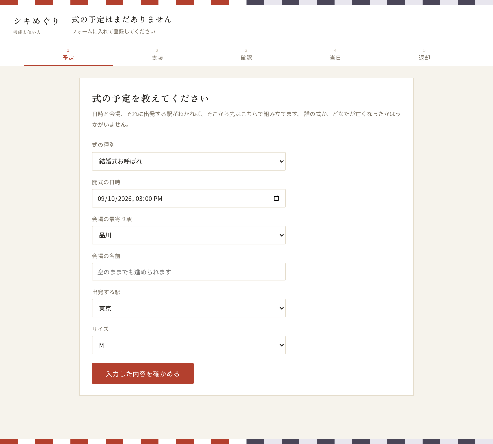
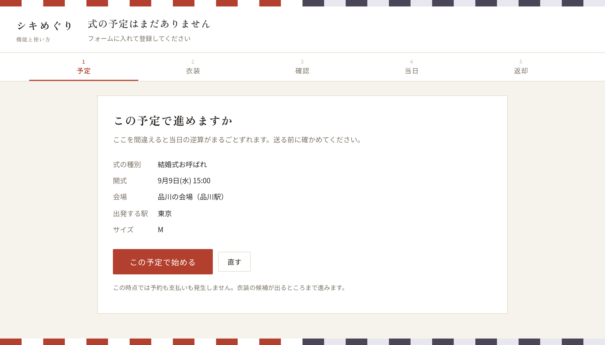
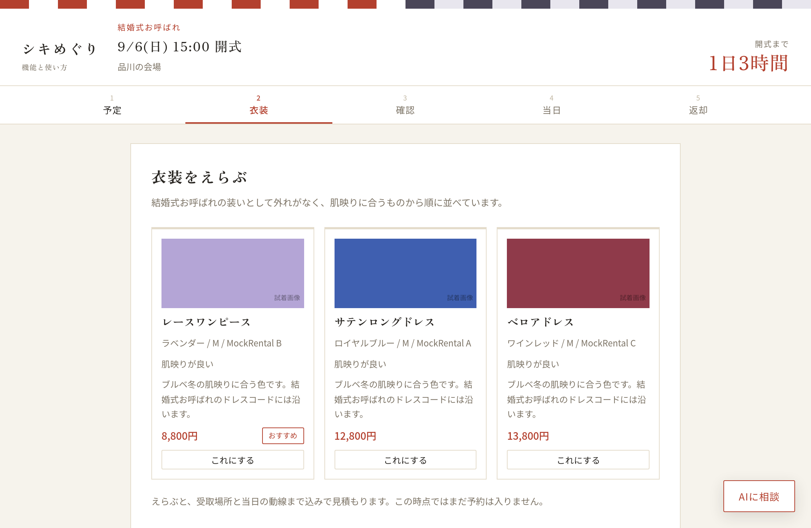
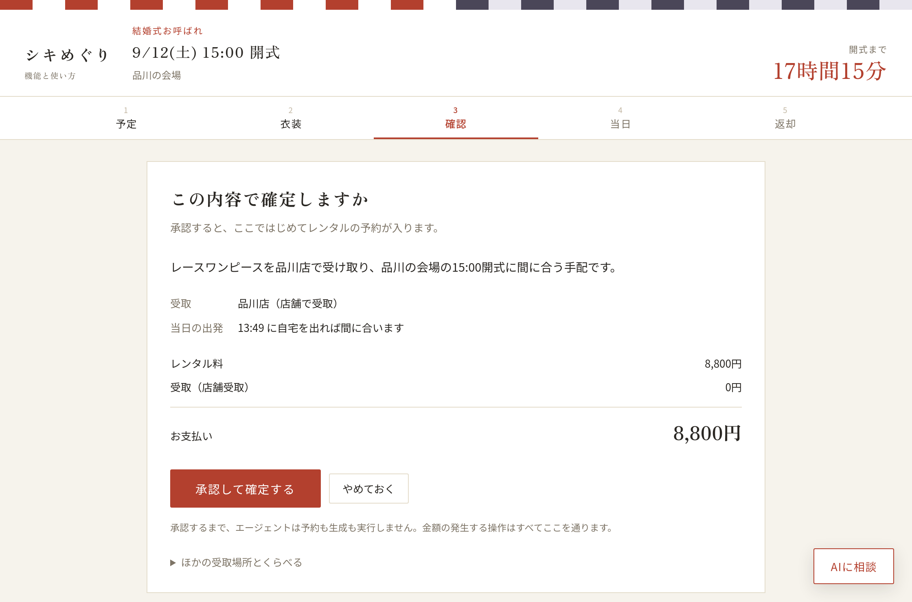
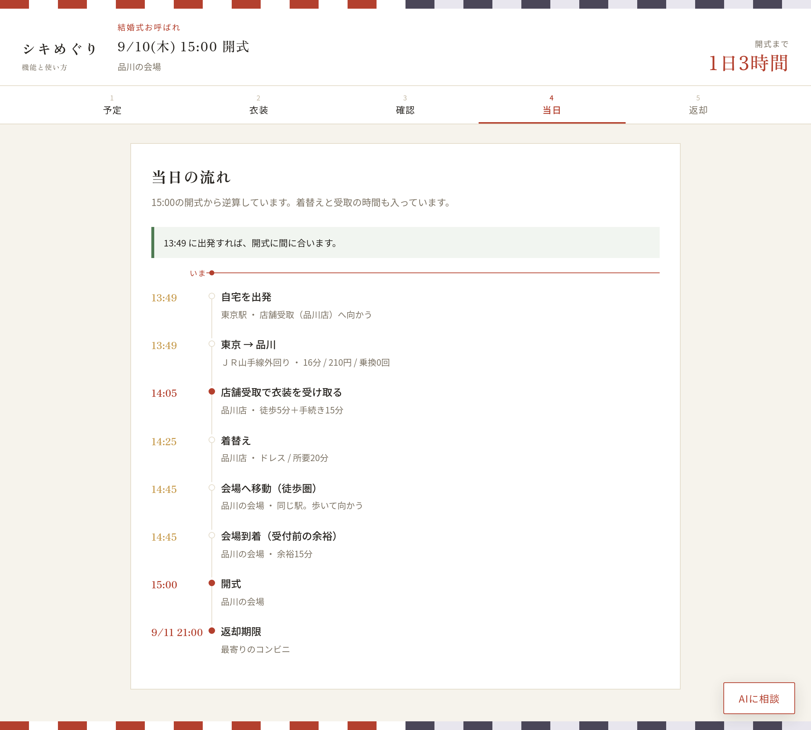
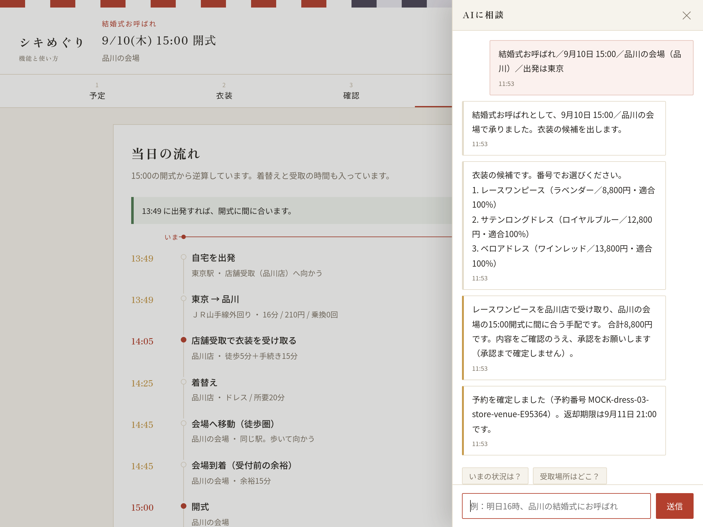
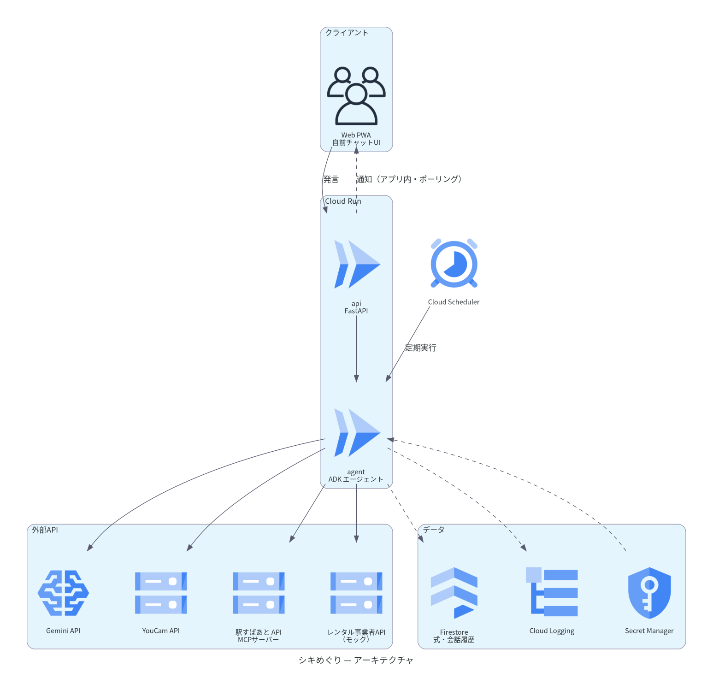

# シキめぐり

冠婚葬祭レンタル × 移動エージェント。

衣装レンタルの「借りるまで」しかなかった体験を、**衣装選び → 受取地最適化 → 当日の逆算動線 → 返却**まで
一気通貫でエージェントが仕切る。金銭が動く操作だけは必ず本人の同意ゲートを通す。

- 開発手順・コードの決まりごと → [CONTRIBUTING.md](CONTRIBUTING.md)

## 画面の流れ

予定を入れてから当日を迎えるまでの、実際の画面。

### 1. 式の予定を入れる

種別・日時・会場の最寄り駅・出発する駅を選ぶ。誰の式かは訊かない。



### 2. 内容を確かめる

ここを間違えると当日の逆算がまるごとずれるので、登録する前に一度見せる。



### 3. 衣装をえらぶ

式の区分に合う候補を、費用の安い順に並べる。えらんでも、この時点ではまだ予約は入らない。



### 4. 金額を確かめて承認する

受取場所と出発時刻、内訳と合計を見て承認する。ここで初めて予約が入る。承認するまで、エージェントは 1 円も確定しない。



### 5. 当日の流れが決まる

開式から逆算した一日が出る。「いま」の位置が入るので、どこまで進んだかが分かる。



### 6. あとは「AIに相談」から

右下のボタンでいつでも開ける。返却期限の注意もここに届く。



画像は `docs/shots.js` が実際に画面を操作して撮っている（撮り直しの手順は [CONTRIBUTING.md](CONTRIBUTING.md)）。

## 動かす

APIキーは不要。未設定のうちは全ての外部サービスが mock で動き、一連の流れが最後まで通る。
データは同梱の Firestore エミュレータに入るので、GCP に繋がなくてよい。

```bash
docker compose up api
```

ブラウザで <http://localhost:8080/ui/> を開くと、機能と使い方をまとめたトップページが出る。
「アプリを開く」からアプリ（<http://localhost:8080/ui/console.html>）へ入り、
最初の画面はフォームだけ。式の予定を入れて内容を確かめると登録され、
そこから先は一本道で進む。

画面は**いま利用者がすることを一つだけ**出す。段階が進むと自動で次に切り替わり、
過去の段階は上の帯から見に戻れる。

| 段階 | 画面に出るもの |
|---|---|
| 1 予定 | 種別・日時・会場の最寄り駅・出発する駅をフォームで入れ、内容を確かめてから登録する。登録後は入力欄が消え、登録した予定の控えになる |
| 2 衣装 | 候補だけを並べる。えらんでもまだ予約は入らない |
| 3 確認 | 受取場所・出発時刻・内訳・合計と、承認／やめておく |
| 4 当日 | 開式から逆算した一日の流れ。「いま」の位置が入る |
| 5 返却 | 期限・返し方・返す場所と、返却の記録 |

見出しには常に**開式までの残り時間**（式のあとは返却期限まで）が出る。

相談欄は予定を登録するまで出さない。登録が済むと右下に「AIに相談」が現れ、押すとサイドバーで開く
（ここからも「1番でお願いします」「承認します」のように進められる）。返却期限の警告など
エージェント起点の通知は、畳んでいる間もトーストとボタンの件数で届く。
監査ログは画面には出さず、`GET /audit` で取る。

## アーキテクチャ



チャットは外部メッセージング基盤を使わず自前で持つため、慶弔という繊細な情報が
第三者のサーバーを経由しない。**通知もアプリ内で完結する**（設計判断）。返却期限の警告など
エージェント起点の発言は、利用者の操作を待たずに画面へ届く。
端末へのプッシュ（Web Push / OS 通知）は対象外。

定期実行（Cloud Scheduler）が返却期限の監視と TTL 超過の削除をまとめて回す。

## エージェントの自律性

エージェントの自律性の境界は、コードの分かれ方と一致している。

| エージェント | 自律性 | 実装 |
|---|---|---|
| 衣装 | 提案まで | `agents/outfit.py` |
| 手配 | **金銭確定は本人同意必須** | `agents/arrange.py`（`propose` と `decide` が分離） |
| 動線 | 逆算タイムラインの生成 | `agents/route.py` |
| 返却監視 | 提案まで | `agents/monitor.py` |

## ガバナンス

1. **画像を扱わない** — 顔写真も全身写真も受け取らない。保持するフィールドが型として存在しない
2. **慶弔情報の最小化** — 「誰の式か」「誰が亡くなったか」を保持するフィールドがそもそも存在しない。日時・会場・服装区分だけで全機能が成立する（テストで検証）
3. **同意ゲート** — 金銭が動く操作は、金額にかかわらず本人の承認を通す。エージェントが自分で確定する経路を持たない
4. **TTL** — `events` は式終了 + 7 日で削除。監査ログは追記専用で独立して残る
5. **プロンプトインジェクション対策** — 利用者の入力が Gemini に届いても、手配は乗っ取られない
   - 金額と承認を求める文面は Gemini に書かせず、コードで組み立てる。金額・承認の可否はそもそもコードが決めている
   - Gemini への指示は system に置き、材料（利用者の入力を含みうる）は区切りの中に JSON で入れる。区切りを閉じる文字と改行は落とす
   - 出てきた文面は検査してから使う。URL を含む・長すぎる・**材料にない数字を書いた**ものは捨てて定型文に落とす
   - 入口でも絞る。駅はどの API でも選択肢の一覧にあるものだけ、会場名は 40 文字まで・改行なし
   - 実際に指示を混ぜた材料で Gemini を呼び、従わないことを確かめた。上の性質はテストで固定している（`tests/test_injection.py`）

## MVP で未実装のもの

- 実レンタル事業者連携（`app/adapters/rental.py` はモック固定）
- 成人式・葬儀ユースケースの作り込み（データモデル・受取制約は実装済み、UI は共通）
